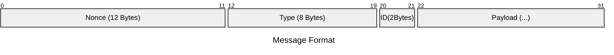
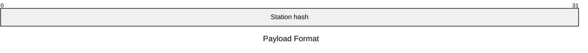
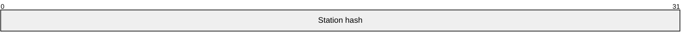
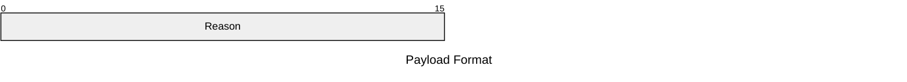
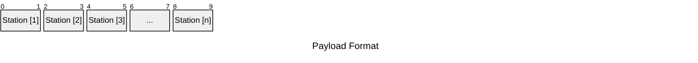
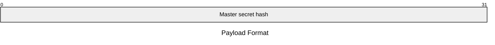
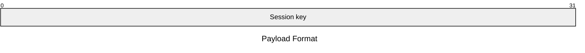
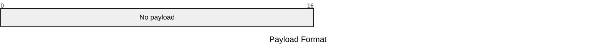
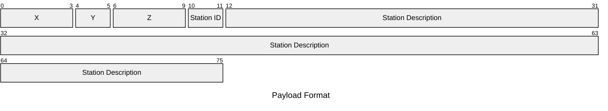
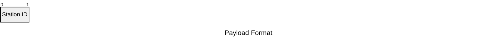

### Master disk
	The master disk is a disk that is used to reboot the network after it has shutdown (often due to server restarts)
	It stores a random message and a "Check hash" it is the message but hashed)
	Both of these are then encrypted using hash(admin_pin + static_salt) as the key
	To verify that a admin is using the master disk the station asks for the admin pin
	Then the station does hash(pin + static_salt)
	The station then decrypts the master disk contents using the new hash
	Then the station does hash(drive_message) if this matches the check hash the station continues it's reboot setup

### Session key
	The key used to encrypt messages and salt hashes during a session. Changes every time the network reboots
### Station data
	The data on a specific station

| Key                  | Type    | Explanation                                                           |
| -------------------- | ------- | --------------------------------------------------------------------- |
| station_id           | integer | The id of the station                                                 |
| description          | string  | A short description of the station.                                   |
| arrival_cordinates   | Vector3 | The coordinates to teleport to when arriving at the station           |
| transfer_coordinates | Vector3 | The coordinates to teleport to when using the station as an inbetween |
### Route list
	The route the user is taking to teleport to their destination. Takes the form of a list containing an arbitrary number of stations and optionaly ending in a  coordinates at the end
### System hash
	A hash made from all the files on a computer and all the peripherals connected to a computer (exluding drives) recalculated on the fly and no parts of it saved to the disk
Calculated with: hash(all_files_hashed + all_periferals_hashed) 
### Nonce
	A string of randomly generated characters used to verify that the hashes sent between two stations aren't saved previous versions

# Rednet messages
## Format
	Nonce: The random bytes used to encrypt the message, and if necessary the station hash
	Type: What the message is about
	ID: The computer id the message was sent from
	Payload: The data sent being sent with the message
	
	Everything except the nonce is encrypted

### Teleport initiate
	The message sent when a station wants to teleport a user to another station
	Type: TeleInit

### Teleport verification
	The message sent from the station being telepoted to, used to verify the station
	Type: TeleVeri

### Teleport denied
	Sent when a station denies a teleport, mostly due to failing a station hash check
	Type: TeleDeni

### Teleport done
	Sent after a station teleports a user to another station
	Type: TeleDone

### Session key request
	A request sent from a station after the master disk is inserted after startup
	Type: SeKeyReq (is not encrypted)

### Session key response
	A response sent to a station after a station has been verified to have the master secret
	Type: SeKeyRes (is not encrypted)

### Clear master
	A message sent when all stations have been activated
	Type: ClearMas

### New station
	Sent from a new station after it has the session key
	Type: NewStati

### New station verification
	Sent from an existing station to start verifying a new one (Encrypted using the master secret)
	Type: NewSVeri

### New neighbour
	Sent from a new station to its bordering stations
	Type: NewNeigh

Maybe use stuff below line
___
### Key exchange begin
	Sent from a station begining the process of sending over a session key

| Key  | Type    | Explanation                             |
| ---- | ------- | --------------------------------------- |
| time | integer | The time the request was sent           |
| type | string  | The type of payload                     |
| p    | integer | The prime used as mod in the exchange   |
| g    | integer | The number used as base in the exchange |
### Key exchange recived
	Sent from a station accepting the process of sending over a session key

| Key  | Type    | Explanation                   |
| ---- | ------- | ----------------------------- |
| time | integer | The time the request was sent |
| type | string  | The type of payload           |
### Key exchange public
	Contains the intermediate step for key exchange

| Key        | Type    | Explanation                   |
| ---------- | ------- | ----------------------------- |
| time       | integer | The time the request was sent |
| type       | string  | The type of payload           |
| public_key | integer | The public key being sent     |
### Key exchange final
	The final thing sent in a key exchange. Contains the session key

| Key         | Type    | Explanation                   |
| ----------- | ------- | ----------------------------- |
| time        | integer | The time the request was sent |
| type        | string  | The type of payload           |
| session_key | integer | The session key               |

